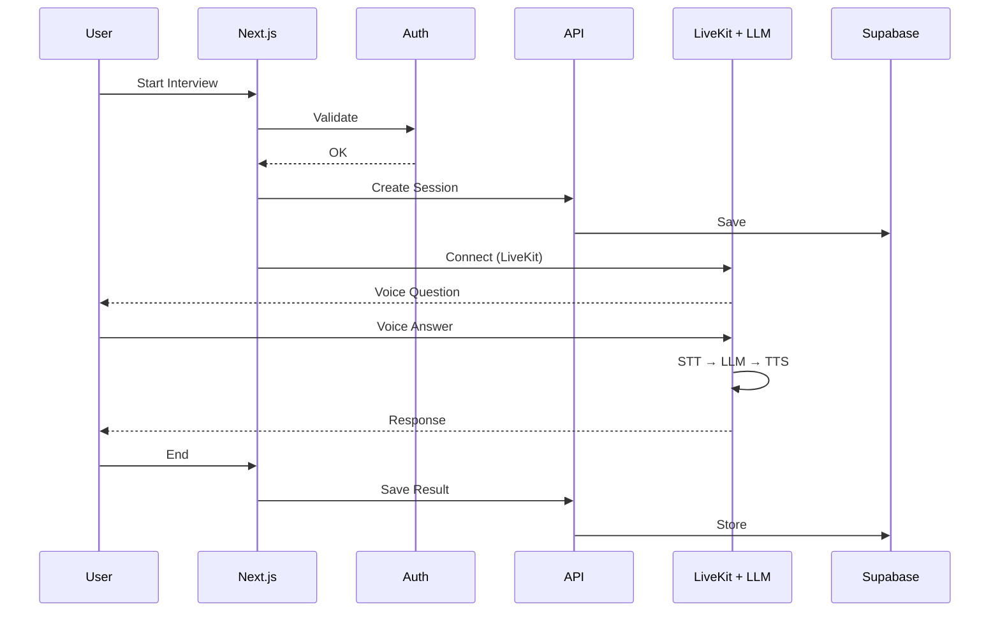

# PRD — AI Voice Interview Simulator (Core Product)

## 1. Overview

Aplikasi ini adalah platform simulasi interview kerja berbasis **AI voice real-time** yang memungkinkan pengguna berlatih interview seperti di dunia nyata.

Berbeda dengan chatbot biasa, sistem ini menggunakan percakapan suara dua arah (real-time) sehingga pengalaman lebih imersif.

### Problem Statement

* User kurang pengalaman interview nyata
* Tidak ada feedback objektif
* Latihan interview masih text-based (tidak realistis)

### Solution

* AI interviewer ("Nara") berbasis voice
* Real-time conversation
* Feedback otomatis berbasis AI

---

## 2. Product Goals

### Primary Goals

* Simulasi interview realistis (voice-based)
* Memberikan feedback actionable
* Melatih komunikasi verbal user

### Success Metrics

* Avg session duration
* Completion rate interview
* Repeat usage (retention)
* Improvement score user

---

## 3. Core Features (MVP)

### 3.1 Authentication

* Register / Login
* Session management

---

### 3.2 Interview Session (CORE FEATURE)

Ini adalah fitur paling penting.

#### Flow:

1. User pilih role & level
2. Sistem buat session
3. LiveKit connect
4. AI mulai interview

#### Capabilities:

* AI bertanya (voice)
* User menjawab (mic input)
* AI memahami jawaban (STT → LLM)
* AI merespon kembali (TTS)

#### Requirements:

* Latency rendah
* Natural conversation
* Context-aware (ingat jawaban sebelumnya)

---

### 3.3 AI Interview Engine

#### Responsibilities:

* Generate pertanyaan
* Menjaga flow interview
* Adapt berdasarkan jawaban user

#### Interview Flow:

* Introduction
* Background questions
* Technical questions
* Behavioral questions
* Closing

#### Logic:

* Gunakan context dari message sebelumnya
* Follow-up question otomatis

---

### 3.4 Feedback System

Setelah interview selesai:

#### Output:

* Communication score
* Technical score
* Confidence (optional)

#### Feedback:

* Strengths
* Weaknesses
* Suggestions

#### Processing:

* Ambil transcript
* Kirim ke AI
* Generate evaluasi

---

### 3.5 Interview History

* Simpan semua session
* Simpan transcript
* Simpan feedback

---

## 4. User Flow

### Main Flow

1. Login
2. Start interview
3. Voice session berjalan
4. End session
5. Lihat feedback
6. Review history

---

## 5. System Architecture

---

## 6. Technical Stack

* Frontend: Next.js (App Router)
* Design: Tailwindcss
* Backend: Next.js API / Server Actions
* Database: Supabase (PostgreSQL)
* ORM: Prisma
* Auth: Better Auth
* Realtime Voice: LiveKit (WebRTC)

---

## 7. Data Model (Simplified)

### interviews

* id
* userId
* role
* level
* score
* createdAt

### messages

* id
* interviewId
* sender (AI/User)
* content

### feedback

* interviewId
* communicationScore
* technicalScore
* strengths
* weaknesses
* suggestions

---

## 8. Non-Functional Requirements

### Performance

* Voice latency < 500ms
* Real-time streaming stabil

### Scalability

* Stateless API
* Supabase scaling

### Security

* Auth protection
* API validation

---

## 9. Risks & Challenges

* Latency voice (LiveKit + AI)
* Accuracy speech-to-text
* Naturalness AI response
* Cost inference AI

---

## 10. Future Enhancements

* Video interview
* Emotion detection
* Custom question
* Multi-language
* AI personality customization
